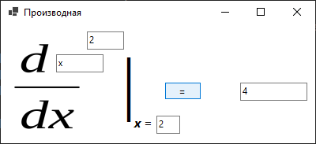

# TRPO-2023
# Руководство пользователя программы "Производная"

## Описание

Программа "Производная" предназначена для вычисления производных степенной и показательной функций. Она позволяет пользователю задать основание и степень функции, а также точку, в которой необходимо вычислить производную.

## Установка

Для установки программы выполните следующие шаги:
1. Скачайте файл с [Google-диска](https://drive.google.com/file/d/1JJPfVXRnbepu7Y5bDknuyFLgzGU1WtTb/view?usp=sharing).
2. Запустите файл установки и следуйте инструкциям.

## Использование программы

### Запуск

Откройте программу через меню "Пуск" или используя ярлык на рабочем столе.

### Ввод данных

Введите значения в поля ввода:

- В поле `Base` введите основание функции (по умолчанию "x").
- В поле `Degree` введите степень функции (по умолчанию "2").
- В поле `X` введите точку, в которой вы хотите вычислить производную.

### Вычисление производной

После ввода всех необходимых данных нажмите кнопку `=`. Результат будет отображен в поле вывода.

## Примеры

Вот пример вычисления производной для функции x^2 в точке x=2:

1. Введите "x" в поле `Base`.
2. Введите "2" в поле `Degree`.
3. Введите "2" в поле `X`.
4. Нажмите `Вычислить`.

Результат: 4

## Лицензия и авторские права

Программа распространяется под лицензией MIT. Все права защищены (с) Зацепин Д.К., 2023.

## Поддержка

Если у вас возникли вопросы или проблемы, свяжитесь с нами по адресу zatsepin_01@mail.ru.
